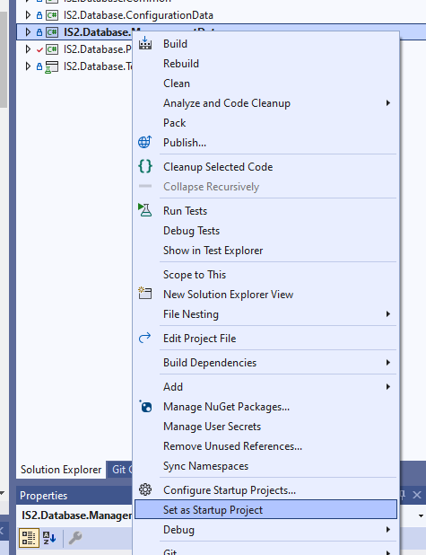
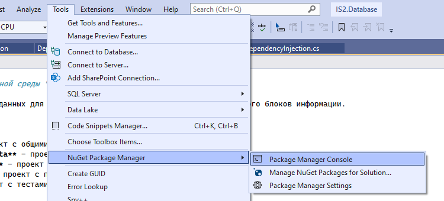
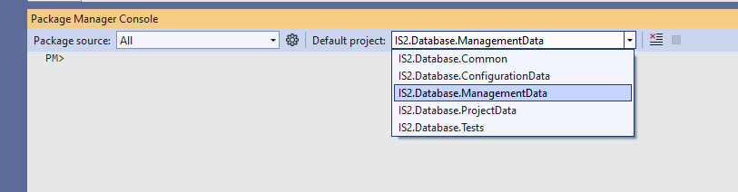
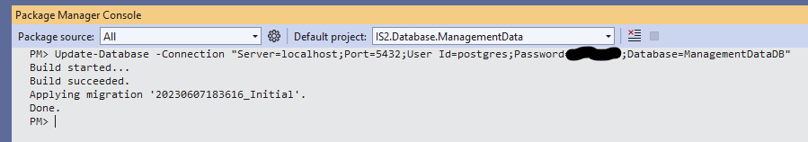
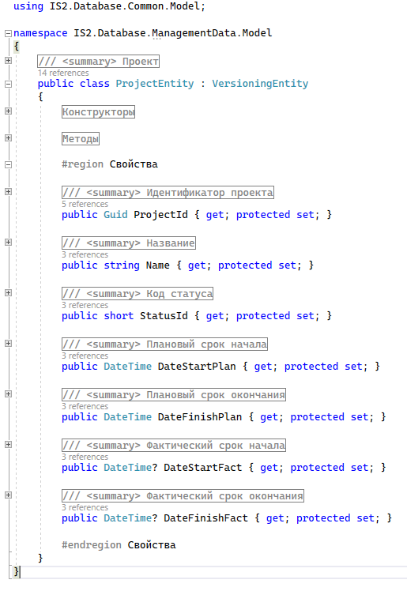
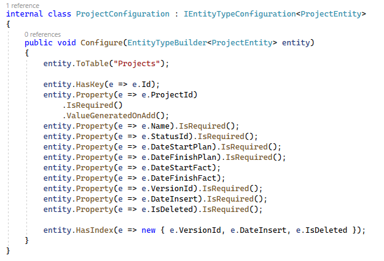

# IS2 Database
## *База данных для интегрированной среды "ИС-2"*

Решение включает реалзиацию баз данных для конфигурационного, управленческого и проектного блоков информации.

## Работа с решением
Для работы необходимы следующие инструменты:
- **Microsoft Visual Studio 2022 Community**, файл с конфигурацией [здесь](docs/.vsconfig)
- **pgAdmin** для подключения к серверу базы данных, [дистрибутивы](https://www.pgadmin.org/download/)
- **PostgreSQL 12+**, [инструкция по установке](https://postgrespro.ru/windows)

## Проекты

- **IS2.Database.Common** - проект с общими методами и классами
- **IS2.Database.ConfigurationData** - проект с конфигурационным блоком данных
- **IS2.Database.ManagementData** - проект с управленческим блоком данных
- **IS2.Database.ProjectData** - проект с проектным блоком данных
- **IS2.Database.Tests** - проект с тестами

## Используемые библиотеки
- [Microsoft.EntityFrameworkCore](https://learn.microsoft.com/ru-ru/ef/core/) - библиотека для работы с базой данных
- [Microsoft.EntityFrameworkCore.Design](https://learn.microsoft.com/ru-ru/ef/core/) - библиотека для создания миграций
- [Microsoft.EntityFrameworkCore.Tools](https://learn.microsoft.com/ru-ru/ef/core/) - инструменты для создания миграций и обновления базы данных
- [Npgsql.EntityFrameworkCore.PostgreSQL](https://github.com/npgsql/efcore.pg) - провайдер PostgreSQL для EntityFramework

## Обновление базы данных
Инструкция универсальна для каждого проекта базы данных.  
В качестве примера будет продемонстрирована установка ManagementData.  
Для создания базы данных из проекта необходимо:  
1. Выбрать проект IS2.Database.ManagementData запускаемым проектом. Правый клик по проекту, в выпадающем списке выбрать *Set as Startup project* 
1. Открыть Package Manager Console. 
1. Выбрать проект IS2.Database.ManagementData проектом по умолчанию. 
1. В консоли ввести команды *Update-Database -Connection "Server=localhost;Port=5432;User Id=postgres;Password=passw0rd;Database=ConfigurationDataDB"*, где в кавычках должна быть указана корректная строка подключения к базе данных. Можно добавить опцию *-Verbose* для подробного вывода. Нажать Enter на клавиатуре для выполнения команды.
1. В случае успеха результат вывода будет таким:

## Внесение изменений в схему базу данных
Для изменений схемы базы данных (например, добавление нового столбца) необходимо:
1. Внести изменения в существующую сущность или добавить новую. На основе сущностей строятся таблицы баз данных. Сущности лежат в папке *Model*.
1. Для каждой сущности есть конфигурация для БД. Возможные варианты настроек доступны по [ссылке](https://learn.microsoft.com/en-us/ef/ef6/modeling/code-first/fluent/types-and-properties).
1. В Package Manager Console ввести команду *Add-Migration NewMigration*, где вместо *NewMigration* должно стоять осмысленное название миграции. Выполнить команду
1. В случае успеха в папке *Migration* появится новый файл миграции.
1. Выполнить команду *Update-Database* для обновления существующей схемы базы данных
  
Возможные команды Package Manager Console перечислены по [ссылке](https://learn.microsoft.com/en-us/ef/core/cli/powershell#add-migration).

## Использование репозиториев
Для управления каждой сущностью реализован соответствующий репозиторий. Репозитории находятся в папках *Repositories* каждого проекта.  
Для регистрации их в контейнер сервисов в каждом проекте есть статический класс *DependencyInjection* с методами *AddConfigurationDataServices*,  *AddManagementDataServices* и *AddProjectDataServices*.  
[Пример](IS2.Database.ConfigurationData/appsettings.json) конфигурационного файла, который должен быть в программе.
